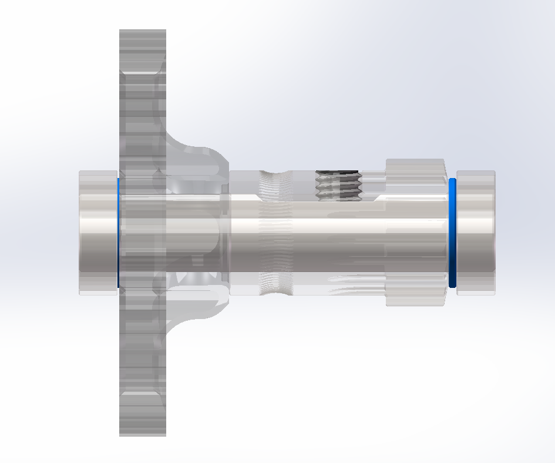

# FYSETC-Annex-Engineering-Sherpa

FYSETC manufacturing information of Sherpa series extruder designed by Annex Engineering

## Sherpa mini

### 1. Project source

You can find the original project [here](https://github.com/Annex-Engineering/Sherpa_Mini-Extruder).

### 2. Applications

If you can design extruder holder for you printer, it can apply to almost any FDM/FFF 3D printer. You can find the known application on machines below.  

CR-10, CR10S, CR-10 4S, CR-10 5S, CR-10 MINI, CR-20, ENDER-2,ENDER-3, ENDER-3 PRO, ENDER-3 V2，VORON，Gasherbrum K3

### 3. Common specifications

Escept specifications below, more spec on each revision, check the `4. Revisions` section.

| Parameters              | Specifications    |
| ----------------------- | ----------------- |
| Housing Color           | black             |
| Housing forming process | SLS               |
| Housing material        | PA                |
| Weight                  | About 136g        |
| Motor cable             | PTFE, 1.2m length |

### 4. Revisions

Check our manufacturing revisions below.

#### Rev 1.0

...

#### Rev 1.1

Stepper motor: 10 teeth Stepper motor, [G36HSY4407-6D-1200A](https://github.com/FYSETC/FYSETC-MOTORS/tree/main/G36HSY4407-6D-1200A)

Reduction ratio: 5:1

Advantages comparing to Rev 1.0:

1. Deticated large torque 36 stepper motor

2. PTFE motor cable

#### Rev 1.5

Stepper motor: 8 teeth Stepper motor, [G36HSY4405-6D-1200A](https://github.com/FYSETC/FYSETC-MOTORS/tree/main/G36HSY4405-6D-1200A)

Reduction ratio: 6.25:1

Advantages comparing to Rev 1.1:

1. 8t motor, 25% more torque

2. New CNC hollowed-out POM [50t gear](https://github.com/Annex-Engineering/Sherpa_Mini-Extruder/blob/master/STLs/FDM_STLs/optional_parts/printable_sherpa_mini_gear_50t_sl_x1_rev1.stl), higher intensity, more precise

3. Isolate the gear positioning, seamless installation, more precise, check the blue part below.
   
   

### 5. Mods

We make some mods for different machine application cases.

[Sherpa Mini Extruder master holder for CR10 Ender3 by FYSETC_Ltd - Thingiverse](https://www.thingiverse.com/thing:4807684)

### 6. Matters need attention

You need to change your E stepper AXIS_STEPS_PER_UNIT parameter. Like Ender3 as an example, you need to set AXIS_STEPS_PER_UNIT to 870 using our Sherpa mini rev1.5. How to change it?

Marlin - Ender3

Method 1: Change the parameter on your firmware

```
#define DEFAULT_AXIS_STEPS_PER_UNIT   { 80, 80, 400, 870 }
```

Method 2: Send Gcode to change it

```
M92 E870
M500
```

For some printers, you may need to adjust the stepper motor E current to prevent overtemp on the stepper motor. Like Ender3, we recommend to set it to 0.35A.

### 7. Where to buy

## Tech Support

Please submit any technical issue into our [forum](http://forum.fysetc.com/) ，[github](https://github.com/FYSETC/FYSETC-Annex-Engineering-Sherpa/issues)，[facebook](https://www.facebook.com/groups/197476557529090), discord
